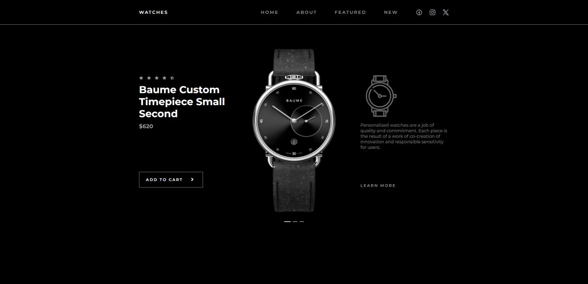

# Responsive Watches Website

This is a Responsive Watches Website Design Using HTML CSS & JavaScript

## Table of contents

- [Overview](#overview)
  - [Project Features](#project-features)
  - [Screenshot](#screenshot)
  - [Links](#links)
- [My process](#my-process)
  - [Built with](#built-with)
  - [What I learned](#what-i-learned)
  - [Useful resources](#useful-resources)
- [Author](#author)

## Overview

- Project start date: 25 April 2024
- Project Duration:

### Project Features

- Responsive Watches Website Design Using HTML CSS & JavaScript
- Contains animated images.
- Developed first with the Mobile First methodology, then for desktop.
- Compatible with all mobile devices and with a beautiful and pleasant user interface.

### Screenshot

| Desktop Version                         | Mobile Version                         |
| --------------------------------------- | -------------------------------------- |
|  |  |

### Links

- [Solution URL](https://github.com/akmtasdikulislam/responsive-watches-website)
- [Live Site URL]()

## My process

### Built with

- Semantic HTML5 markup
- CSS custom properties
- Flexbox

### What I learned

### Useful resources

## Author

- Frontend Mentor - [@akmtasdikulislam](https://www.frontendmentor.io/profile/akmtasdikulislam)
- Twitter - [@Akm_Tasdikul](https://www.twitter.com/Akm_Tasdikul)
