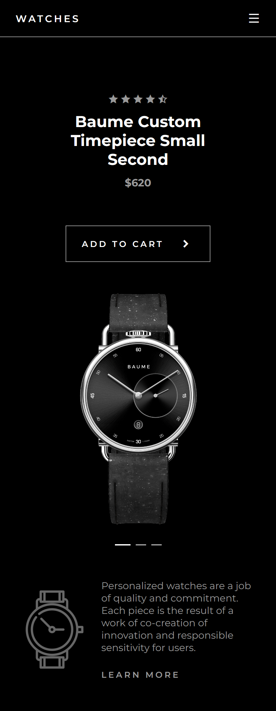

# Responsive Watches Website

This is a Responsive Watches Website Design Using HTML CSS & JavaScript

## Table of contents

- [Overview](#overview)
  - [Project Features](#project-features)
  - [Screenshot](#screenshot)
  - [Links](#links)
- [My process](#my-process)
  - [Built with](#built-with)
  - [What I learned](#what-i-learned)
  - [Useful resources](#useful-resources)
- [Author](#author)
- [Acknowledgement](#acknowledgement)

## Overview

- Project start date: 25 April 2024
- Project Duration: 1 hours

### Project Features

- Responsive Watches Website Design Using HTML CSS & JavaScript
- Contains animated images.
- Developed first with the Mobile First methodology, then for desktop.
- Compatible with all mobile devices and with a beautiful and pleasant user interface.

### Screenshot

| Desktop Version                         | Mobile Version                        |
| --------------------------------------- | ------------------------------------- |
|  |  |

### Links

- [Solution URL](https://github.com/akmtasdikulislam/responsive-watches-website)
- [Live Site URL](https://akmtasdikulislam.github.io/responsive-watches-website/)

## My process

- At first I wrote necessary `html` code to structure the website.
- Then I wrote necessary `css` styles for the navigation menu at first, then for other home elements.
- Then I wrote necessary `js` code to toggle the navigation menu on mobile-devices.
- Also I wrote necessary `js` code for the watch swiper/slider.
- Moreover, I wrote necessary `js` code for onLand (at first sight) animations.
- Finally, I wrote necessary _CSS Media Queries_ for the optimal view on different devices.

### Built with

- Semantic HTML5 markup
- CSS custom properties
- Flexbox
- CSS Grid

### What I learned

- By doing this project, I learned about the following frameworks
  - SwiperJS
  - GSAP - Animate Anything

### Useful resources

- [SwiperJS](https://swiperjs.com/) - I took the swiper/slider to showcase the wathces from here.
- [GSAP - Animate Anything](https://gsap.com/) - I took OnLand (first sight) animation from here.

## Author

- Frontend Mentor - [@akmtasdikulislam](https://www.frontendmentor.io/profile/akmtasdikulislam)
- Twitter - [@Akm_Tasdikul](https://www.twitter.com/Akm_Tasdikul)

## Acknowledgement

This project is done by following the video tutorial of [BEDIMCODE](https://www.youtube.com/@Bedimcode). Here is the tutorial - [Responsive Watches Website Using HTML CSS And JavaScript | Product Page Website](https://www.youtube.com/watch?v=0GT6yF3r10Q&pp=ygUJYmVkaW1jb2Rl)
